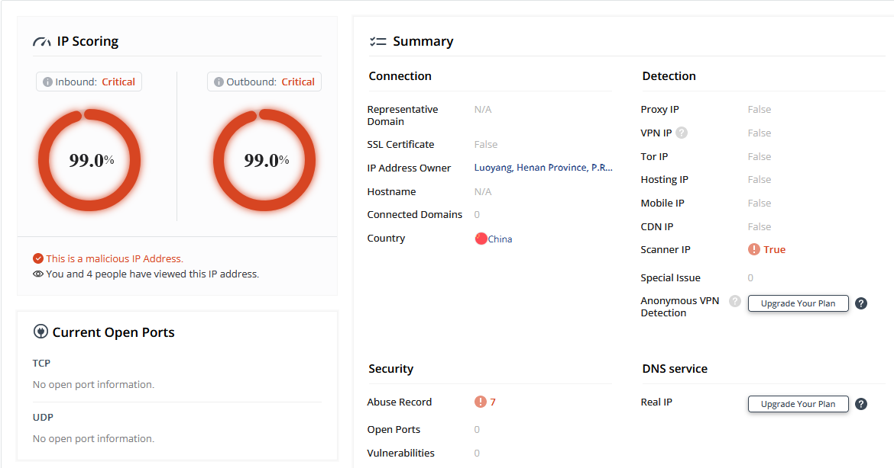

# schutz-server-raspi
Eigener vorgelagerter Server mit Node.js, zum Schutz des Node-RED-Servers auf dem Raspberrypi. 
### Du verwendest Node-RED auf dem Raspberrypi für Sensoren im Haus und möchtest ab und zu einige Daten auch von außerhalb des lokalen Netzwerkes abfragen? ###
Ein guter Schutz gegen Hacker ist der hier vorgestellte Server nicht, er sorgt nur dafür, dass eine unerwünschte IP-Adresse keine Daten ausgeliefert bekommt. (Besseren Schutz bieten Firewalls; und das Betriebsystem selbst blockt unerwünschte IP-Adressen effektiver.)
Ich senke die Sicherheit zugunsten von Einfachheit, aber das ist besser als gar keine Vorkehrung. 
Ich möchte zweierlei erreichen. Zum einen möchte ich nicht aller Welt (Internet) erlauben, auf meinen privaten, lokalen Node-RED Server, der auf meinem Raspberrypi läuft, zugreifen zu können (Port 1880). Daher erstelle ich ein dem Node-RED-Server vorgelagerten Server (auf Port 9000). Der Port 1880 bleibt verborgen, nur der Port 9000 ist öffentlich erreichbar. 
Zum anderen möchte ich auf diesen vorgelagerten Server Regeln implementieren, die eingehalten werden müssen, ansonsten wird man "ignoriert". Meine Spielregel ist die Einhaltung von nicht mehr als eine Server-Abfrage pro Sekunde; auch eine falsche URL führt zur Ignorierung. 
Um einen Port vom Internet aus anzusprechen, muß dieser Port (Port 9000) im Router freigegeben werden (Handbuch des jeweiligen Router-Herstellers lesen). An dieser Stelle sei noch auf die Dringlichkeit eines guten Passwortes für den Zugang zum Router hingewiesen (bitte nicht Passwort : '12345'). In den Router-Einstellungen findet man auch die eigene IP-Adresse, diese ist in der Regel für 24 Stunden gültig und unter dieser Adresse ist man dann auch vom Internet aus erreichbar ( eigeneIPadresse:Port/url ). Zum Testen reichen 24 Stunden aus, ansonsten muß ein zusätzlicher Dienst hinzugezogen werden, der die sich ändernde IP-Adresse automatisch protokolliert (DNS-Dienst).
Node.js muß auf dem Rechner (Raspberrypi) installiert sein, es bringt auch alle für dies Projekt erforderlichen Module (http und fs) schon mit. 
Interresant zu beobachten ist die Tatsache, daß die Schwarze Liste , die der Server anlegt (gebannte und zu ignorierenden IP-Adressen), jede Woche um ca. 4 IP-Adressen anwächst (manchmal verbanne ich mich auch selbst) und im Internet kann man Infos zu diesen IP-Adressen bekommen [link_Website_criminalip][1]. Diese IP-Adressen sind wenig vertrauenserweckend, unabhängig vom Land (USA, China, Niederlande, England, Japan, ...). 
Die Daten, die ich abrufe, sind nur Temperaturdaten, es gehen also keine vertraulichen Daten auf Reisen, HTTP ohne SSL ist nicht jedermanns Wunsch, aber mir reicht das vorerst und es dient als Lehre. 

[1]: https://www.criminalip.io/